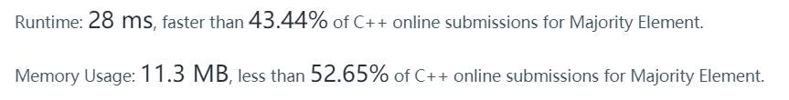

> 169. Majority Element
>
> Given an array of size *n*, find the majority element. The majority element is the element that appears **more than** `⌊ n/2 ⌋` times.
>
> You may assume that the array is non-empty and the majority element always exist in the array.
>
> **Example 1:**
>
> ```
> Input: [3,2,3]
> Output: 3
> ```
>
> **Example 2:**
>
> ```
> Input: [2,2,1,1,1,2,2]
> Output: 2
> ```

题目很简单，很容易给出O(n)的算法，使用了hashmap：

```cpp
class Solution {
public:
    int majorityElement(vector<int>& nums) {
        map<int,int> m;
        int len = nums.size();
        for(int i=0; i<len; i++){
            int e = nums[i];
            if(!m[e]) m[e] = 1;
            else m[e]++;
            if(m[e] > len/2) return e;
            //cout << "element: "<< e << " count: "<< m[e] << endl;
        }
        //cout << "last element: "<< nums[len-1] << " count: "<< m[nums[len-1]] << endl;
        //return nums[len-1];
        return -1; // error， 这里不加这句return -1;就是不给过编译，其实输入符合题目要求的话，程序执行时候不可能走到这里的；不过毕竟编译时候也不知道程序输入是什么，所以报错也是"cc1plus: some warnings being treated as errors"，这编译器算是对程序比较严格了……
    }
};
```

然鹅结果却是非常慢，只超过了40+%的代码……黑人问号脸.jpg



后来看了解答发现有很多种解法，我这种确实是比较慢的了（可能是我代码写的烂……）

最优方法应该是叫`Boyer-Moore Voting Algorithm`，也就是Solution里面的第六种解法（ 时间复杂度O(n)，空间复杂度O(1) ）：

