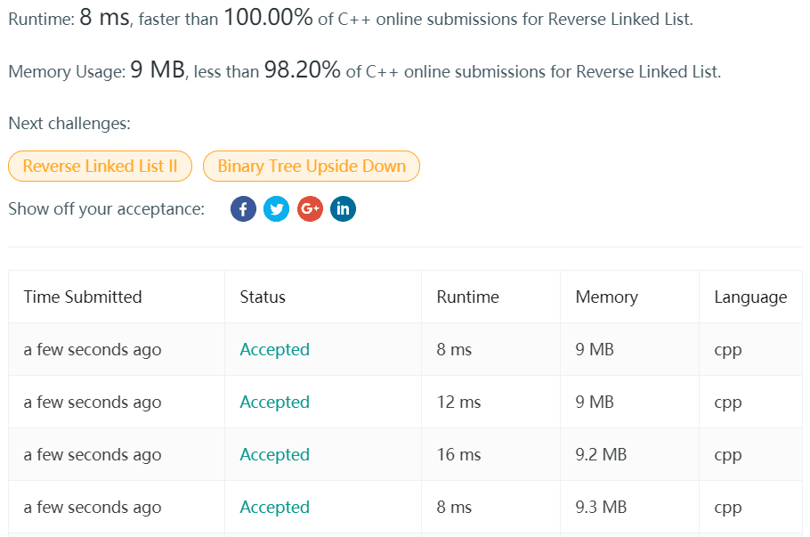

> 206. ### Reverse Linked List
>
> Reverse a singly linked list.
>
> **Example:**
>
> ```
> Input: 1->2->3->4->5->NULL
> Output: 5->4->3->2->1->NULL
> ```
>
> **Follow up:**
>
> A linked list can be reversed either iteratively or recursively. Could you implement both?

#### 迭代版本：

```cpp
/**
 * Definition for singly-linked list.
 * struct ListNode {
 *     int val;
 *     ListNode *next;
 *     ListNode(int x) : val(x), next(NULL) {}
 * };
 */
class Solution {
public:
    ListNode* reverseList(ListNode* head) {
        if(!head || !head->next) return head;
        
        ListNode* last =nullptr;
        auto savedNext = head;
        do{
            savedNext = savedNext->next;
            head->next = last;
            last = head;
            head = savedNext;
        }while(head);
        return last;
    }
};
```

吐槽一下，这个非递归版本，提交了四次，四次结果不一样：




#### 递归版本：

```cpp
/**
 * Definition for singly-linked list.
 * struct ListNode {
 *     int val;
 *     ListNode *next;
 *     ListNode(int x) : val(x), next(NULL) {}
 * };
 */
class Solution {
public:
    ListNode* res = nullptr;
    void revList(ListNode* t, ListNode* last){
        if(!t){
            res = last;
            return;
        }
        revList(t->next, t);
        t->next = last;
    }
    ListNode* reverseList(ListNode* head) {
        //if(!head) return head;
        revList(head, nullptr);
        return res;
    }
};
```

递归版本也一样……提交两次运行时间差这么多……根据上面迭代版本的结果，不太相信这是受缓存的影响。

